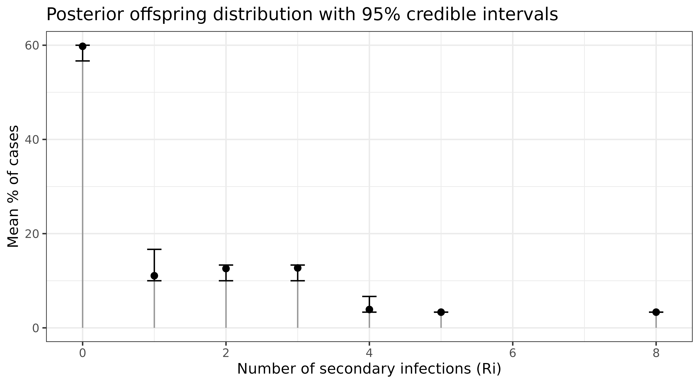

# Extended analyses

``` r
library(dplyr)
library(tidyr)
library(ggplot2)
library(outbreaker2)
library(o2ools)
```

## Reproduction number

We can estimate the case reproductive number ($R_{i}$), *i.e.* the
number of secondary infections generated by each case, with the `get_Ri`
function:

``` r
out_id <- identify(out, linelist$name)

# A matrix of R values
# Columns refer to the case ID
# Rows refer to the MCMC iteration
Ri_mat <- get_Ri(out_id)
```

You can plot the offspring distribution:

``` r
Ri_mat %>% 
  mutate(step = row_number()) %>% 
  pivot_longer(-step, names_to = "name", values_to = "Ri") %>%
  group_by(step, Ri) %>%
  summarise(n = n(), .groups = "drop_last") %>%
  mutate(percent = n / sum(n) * 100) %>%
  ungroup() %>%
  group_by(Ri) %>%
  summarise(
    mean = mean(percent),
    lower = quantile(percent, 0.025),
    upper = quantile(percent, 0.975),
    .groups = "drop"
  ) %>%
  ggplot(aes(x = Ri, y = mean)) +
  geom_segment(aes(x = Ri, xend = Ri, y = 0, yend = mean), colour = "grey60", size = 0.5) +
  geom_point(size = 2) +
  geom_errorbar(aes(ymin = lower, ymax = upper), width = 0.2) +
  labs(x = "Number of secondary infections (Ri)",
       y = "Mean % of cases",
       title = "Posterior offspring distribution with 95% credible intervals")+
  theme_bw()
```



## Serial interval

The serial interval (SI) is the time between the onset of symptoms in an
infector-infectee pair. You can compute the SI’s empirical cumulative
density functionusing with
[`get_si()`](https://cygei.github.io/o2ools/reference/get_si.md) :

``` r
trees <- get_trees(out_id, onset = linelist$onset)
si <- get_si(trees, date_suffix = "onset")

si |>
  ggplot(aes(x = x, y = mean))+
  geom_point() +
  geom_ribbon(aes(ymin = lwr, ymax = upr),
              fill = "grey",
              alpha = 0.5) +
  labs(x = "serial interval", y = "Percent")+
  theme_bw()
```


## Model convergence

*outbreaker2* uses Bayesian inference to account for uncertainty in who
infected whom by sampling multiple plausible transmission trees from the
posterior distribution. Standard MCMC diagnostics evaluate parameter
chains (see
[`?plot.outbreaker_chains`](https://rdrr.io/pkg/outbreaker2/man/outbreaker_chains.html)
and
[`?coda::gelman.diag`](https://rdrr.io/pkg/coda/man/gelman.diag.html))
rather than transmission events themselves.

[*mixtree*](https://cygei.github.io/mixtree/) provides a statistical
framework for comparing collections of transmission trees (*epidemic
forests*) to assess whether they originate from the same generative
process. To evaluate MCMC convergence, *mixtree* can be used to compare
epidemic forests sampled from multiple parallel MCMC chains. If the
chains have converged, the resulting epidemic forests should be
statistically indistinguishable.

### Run multiple chains of *outbreaker2*

``` r
data <- outbreaker_data(dna = fake_outbreak$dna, dates = linelist$onset, ctd = fake_outbreak$ctd, w_dens = fake_outbreak$w)

# Run multiple chains of outbreaker2 in parallel with furrr
library(furrr)
n_chains <- 5
plan(multisession, workers = n_chains) #make sure to set the number of workers to the number of cores on your machine

set.seed(123)
chains <- future_map(1:n_chains, function(i) {
  out <- outbreaker(data = data)
  #brunin
  out[out$step>500, ]
}, .options = furrr_options(seed = TRUE))
```

### Extract trees

``` r
trees <- lapply(chains, function(x) {
  get_trees(x)
})
```

We now have 5 epidemic forests, one for each chain.

##### Chi-squared test

``` r
library(mixtree)

set.seed(123)
do.call(what = mixtree::tree_test, args = c(trees, list(
  method = "chisq",
  test_args = list(simulate.p.value = TRUE, B = 999)
)))
#> 
#>  Pearson's Chi-squared test with simulated p-value (based on 999
#>  replicates)
#> 
#> data:  count data
#> X-squared = 78.327, df = NA, p-value = 1
```

We used the chi-squared test to test the null hypothesis that the
frequency of infector-infectee pairs is the similar between forests. A
p-value of 1 indicates similarity between the forests, suggesting
convergence. The chi-squared test allows for multiple introductions,
unlike PERMANOVA.

##### PERMANOVA

PERMANOVA only accepts one introduction event, so we need to re-run
*outbreaker2* allowing for a single introduction event only. We can do
this by setting the `find_import` argument to `FALSE`.

``` r
set.seed(123)
chains <- future_map(1:n_chains, function(i) {
  out <- outbreaker(
    data = data,
    config = outbreaker2::create_config(find_import = FALSE, move_kappa = FALSE)
  )
  #brunin
  out[out$step>500, ]
}, .options = furrr_options(seed = TRUE))

trees <- lapply(chains, function(x) {
  tree_list <- get_trees(x)
  lapply(tree_list, function(tree) {
    # Remove the imported case
    tree[!is.na(tree$from), ]
  })
})

set.seed(123)
do.call(what = mixtree::tree_test, args = c(trees, list(
  method = "permanova",
  test_args = list(permutations = 100)
)))
#> Permutation test for adonis under reduced model
#> Permutation: free
#> Number of permutations: 100
#> 
#> (function (formula, data, permutations = 999, method = "bray", sqrt.dist = FALSE, add = FALSE, by = NULL, parallel = getOption("mc.cores"), na.action = na.fail, strata = NULL, ...) 
#>           Df SumOfSqs      R2      F Pr(>F)
#> Model      4     3156 0.00493 1.1703 0.2772
#> Residual 945   637030 0.99507              
#> Total    949   640185 1.00000
```

PERMANOVA tests whether the variance in tree topology is similar between
*forests*. A p-value \> 0.05 suggests that the topologies of the trees
do not differ significantly across the 5 *forests*, suggesting
convergence.

## Group transmission patterns

Transmission chains can inform on the patterns of transmission between
groups. [*linktree*](https://cygei.github.io/linktree/) provides a
framework for estimating *group transmission assortativity* which
quantifies the extent to which individuals transmit within their own
group compared to others.

This requires knowledge of group sizes or their relative proportions. In
our example, say the staff-to-patient ratio in the hospital is 1:3. It
is also advised to analyse the transmission chains before *saturation*
(*i.e.* the epidemic peak).

### Estimate the peak date

We’ll estimate the peak date with the *incidence2* package.

``` r
library(incidence2)
linelist$date_onset <- as.Date(linelist$onset, origin = "2020-01-01") 

incid <- incidence2::incidence(linelist, 
                               date_index = "date_onset", 
                               groups = "group")
peak <- estimate_peak(regroup(incid), progress = FALSE)$observed_peak
peak
#> [1] "2020-01-11"
```

### Mask non-direct transmissions

Group transmission assortativity is estimated from direct transmissions
only. We can use the `filter_chain` function to mask non-direct
transmissions (*i.e.* where `kappa`\>1).

``` r
out_direct <- filter_chain(
  out,
  param = "kappa",
  thresh = 1,
  comparator = "==",
  target = "alpha" # keep alpha values where kappa == 1
)

trees <- get_trees(out_direct,
                   group = linelist$group,
                   onset = linelist$date_onset)

# keeps only rows where both onset dates are on or before peak
cut_trees <- lapply(trees, function(tree) {
  tree |> filter(from_onset <= peak, to_onset <= peak)
})
```

### Estimate group transmission assortativity

**To run the below you need to install *linktree* from
[GitHub](https://github.com/CyGei/linktree/).**

For a given tree, we can estimate the groups’ transmission assortativity
coefficients with:

``` r
library(linktree)
# staff-to-patient ratio
ratio <- c("hcw" = 1, "patient" = 3) 

max_post <- trees[[which.max(out$post)]]
delta <- linktree::get_delta(from = max_post$from_group, to = max_post$to_group, f = ratio)
plot(delta)
```

To account for uncertainty in who infected whom, we can compute the
posterior distribution of assortativity coefficients. This is done by
estimating `delta` for each tree in the posterior sample.

``` r
deltas <- lapply(trees, function(x) {
  linktree::get_delta(from = x$from_group, to = x$to_group, f = ratio)
}) |>
  bind_rows(.id = "tree")

ggplot(deltas) +
  geom_density(aes(x = est, fill = group), bw = 0.03, color = "white") +
  scale_x_continuous(limits = c(-1, 1), breaks = seq(-1, 1, 0.2)) +
  scale_fill_manual(values = c("hcw" = "orange", "patient" = "purple")) +
  theme_classic() +
  theme(legend.position = c(0.1, 0.85))
```

Convert `delta` to `gamma` for interpretatibilty:

``` r
gammas <- deltas |> 
  group_by(group) |>
  summarise(
    mean = mean(est),
    q025 = quantile(est, 0.025),
    q975 = quantile(est, 0.975)
  ) |>
  mutate(across(.cols = -group, ~ linktree::delta2gamma(.x)))

head(gammas)
```

Healthcare workers are nearly 5 times more likely to infect other HCWs
whereas patients are 2.6 (`1/0.387`) times more likely to infect other
HCWs.
