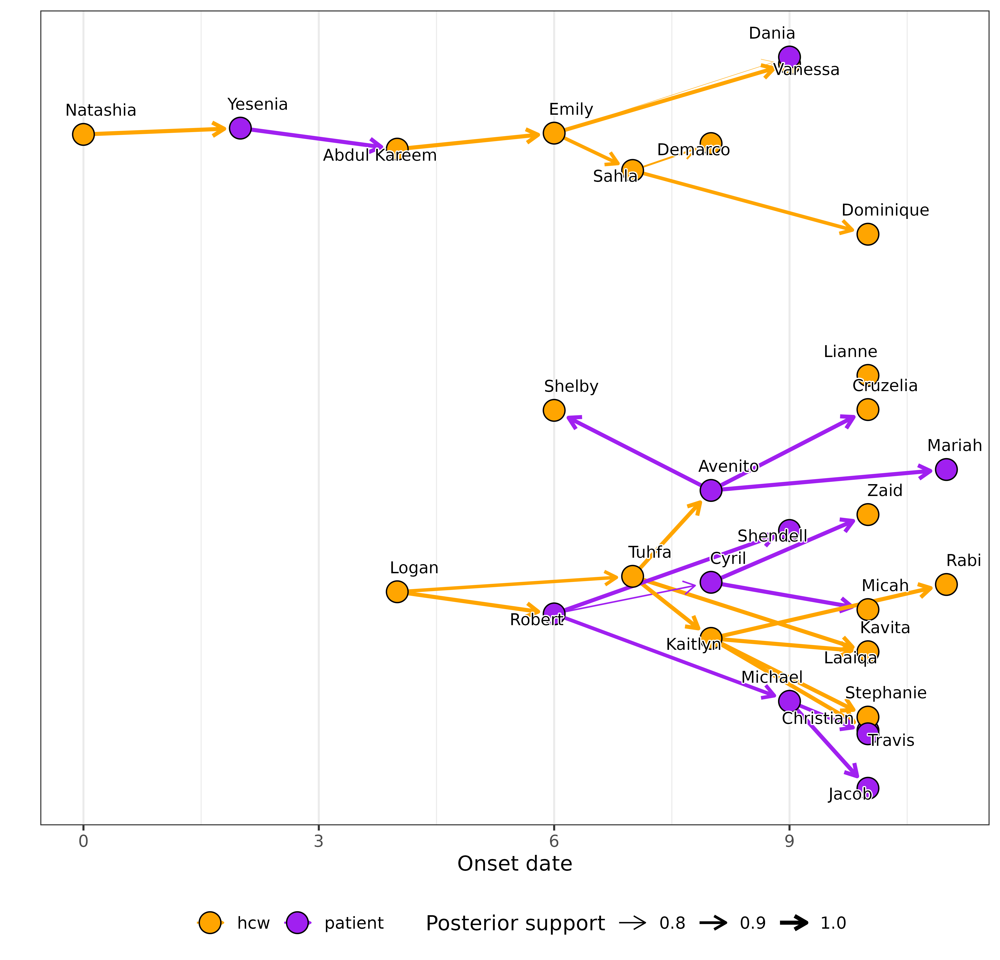

# Processing the output of outbreaker2 with o2ools

``` r
library(outbreaker2)
library(o2ools)
```

## Introduction

The *o2ools* package provides helper functions to process and summarise
the results from
[outbreaker2](https://www.repidemicsconsortium.org/outbreaker2/).  

Below we use the default `fake_outbreak` example in the *outbreaker2*
vignette.

``` r
# The input data 
head(linelist)
#>   id         name   group onset sample
#> 1  1     Natashia     hcw     0      3
#> 2  2      Yesenia patient     2      5
#> 3  3 Abdul Kareem     hcw     4      6
#> 4  4        Logan     hcw     4      6
#> 5  5        Emily     hcw     6      7
#> 6  6       Shelby     hcw     6      9

# outbreaker2 result
out
#> 
#> 
#>  ///// outbreaker results ///
#> 
#> class:  outbreaker_chains data.frame
#> dimensions 201 rows,  98 columns
#> ancestries not shown: alpha_1 - alpha_30
#> infection dates not shown: t_inf_1 - t_inf_30
#> intermediate generations not shown: kappa_1 - kappa_30
#> 
#> /// head //
#>   step       post       like    prior           mu        pi       eps
#> 1    1 -1198.0669 -1199.4211 1.354240 0.0001000000 0.9000000 0.5000000
#> 2   50  -576.3898  -578.4358 2.046006 0.0001322360 0.9719080 0.6238018
#> 3  100  -579.1822  -580.9235 1.741283 0.0001218749 0.9395509 0.5810956
#>       lambda
#> 1 0.05000000
#> 2 0.06582716
#> 3 0.10193745
#> 
#> ...
#> /// tail //
#>      step      post      like    prior           mu        pi       eps
#> 199  9900 -563.6538 -565.2708 1.616983 0.0001236515 0.9266639 0.7634021
#> 200  9950 -567.0488 -569.0806 2.031785 0.0001179255 0.9703719 0.7057554
#> 201 10000 -564.4037 -565.6457 1.242090 0.0001456115 0.8888590 0.6301657
#>         lambda
#> 199 0.07471296
#> 200 0.07418330
#> 201 0.08802858
```

### Identify

By default *outbreaker2* will return a dataframe where each case is
referred to by an integer based on the order of the cases in the
linelist. The columns of this dataframe are named according to the
parameters of interest. For example, `t_inf_1` refers to the infection
time of case 1, `alpha_1` refers to the ancestor of case 1, etc.

To swap-in our real case IDs, we use
[`identify()`](https://cygei.github.io/o2ools/reference/identify.md):

``` r
out_id <- identify(out, ids = linelist$name)
head(out_id)
#> 
#> 
#>  ///// outbreaker results ///
#> 
#> class:  outbreaker_chains data.frame
#> dimensions 6 rows,  98 columns
#> ancestries not shown: alpha_Natashia - alpha_Rabi
#> infection dates not shown: t_inf_Natashia - t_inf_Rabi
#> intermediate generations not shown: kappa_Natashia - kappa_Rabi
#> 
#> /// head //
#>   step       post       like    prior           mu        pi       eps
#> 1    1 -1198.0669 -1199.4211 1.354240 0.0001000000 0.9000000 0.5000000
#> 2   50  -576.3898  -578.4358 2.046006 0.0001322360 0.9719080 0.6238018
#> 3  100  -579.1822  -580.9235 1.741283 0.0001218749 0.9395509 0.5810956
#>       lambda
#> 1 0.05000000
#> 2 0.06582716
#> 3 0.10193745
#> 
#> ...
#> /// tail //
#>   step      post      like    prior           mu        pi       eps     lambda
#> 4  150 -572.0877 -574.1242 2.036517 0.0001167833 0.9708822 0.6950082 0.05255790
#> 5  200 -583.3893 -585.6191 2.229780 0.0001288618 0.9919574 0.5482067 0.12669178
#> 6  250 -567.8580 -569.6462 1.788133 0.0001170668 0.9444540 0.7248895 0.05055557
```

### Get individual trees

To extract the individual trees from the posterior sample, we use
[`get_trees()`](https://cygei.github.io/o2ools/reference/get_trees.md).
This function will return a list of trees, one for each sample in the
posterior. You can add additional *outbreaker2* results to the trees,
such as the infection times (`t_inf`), the number of generations
(`kappa`) and other attributes from the linelist.

``` r
trees <- get_trees(out_id, kappa = TRUE, t_inf = TRUE, group = linelist$group)
#100th sample
head(trees[[100]])
#>           from           to from_kappa to_kappa from_t_inf to_t_inf from_group
#> 1         <NA>     Natashia         NA       NA         NA       -1       <NA>
#> 2     Natashia      Yesenia         NA        1         -1        2        hcw
#> 3      Yesenia Abdul Kareem          1        1          2        3    patient
#> 4         <NA>        Logan         NA       NA         NA        2       <NA>
#> 5 Abdul Kareem        Emily          1        1          3        4        hcw
#> 6      Avenito       Shelby          1        1          6        8    patient
#>   to_group
#> 1      hcw
#> 2  patient
#> 3      hcw
#> 4      hcw
#> 5      hcw
#> 6      hcw
```

### Performance

#### Accuracy

Accuracy is the proportion of cases that are correctly identified across
the posterior sample. **You can only use this function if you have the
true ancestry information for each case**.

``` r
true_tree <- data.frame(
  from = as.character(outbreaker2::fake_outbreak$ances),
  to   = linelist$id,
  stringsAsFactors = FALSE
)

accuracy <- get_accuracy(out, true_tree)
hist(accuracy)
```


#### Entropy

Entropy measures the uncertainty in a case’s ancestry. The more
potential ancestors a case has, the greater its entropy. By default,
entropy is bounded between 0 and 1, where 0 indicates no uncertainty
about a case’s ancestry, and 1 indicates maximum uncertainty.

``` r
entropy <- get_entropy(out_id)
barplot(
  entropy,
  horiz = TRUE,
  las = 1
  )
```


### Visualisation

#### Augment the linelist with *outbreaker2*’s results

To add the results from *outbreaker2* to the linelist, we can use
[`augment_linelist()`](https://cygei.github.io/o2ools/reference/augment_linelist.md).
This function will add summary statistics for each case, such as the
infection times inferred by *outbreaker2*.

``` r
# augment linelist with summaries of t_inf and kappa
o2linelist <- augment_linelist(
  out, linelist,
  params  = c("t_inf","kappa"),
  summary_fns = list(
    mean = function(x) mean(x, na.rm = TRUE),
    q25  = function(x) quantile(x, .25, na.rm = TRUE),
    q75  = function(x) quantile(x, .75, na.rm = TRUE)
  )
)
head(o2linelist)
#>   id         name   group onset sample t_inf_mean t_inf_q25 t_inf_q75
#> 1  1     Natashia     hcw     0      3 -0.6766169        -1         0
#> 2  2      Yesenia patient     2      5  1.2686567         1         2
#> 3  3 Abdul Kareem     hcw     4      6  2.6716418         2         3
#> 4  4        Logan     hcw     4      6  2.2835821         2         3
#> 5  5        Emily     hcw     6      7  4.0099502         4         4
#> 6  6       Shelby     hcw     6      9  7.7213930         7         8
#>   kappa_mean kappa_q25 kappa_q75
#> 1        NaN        NA        NA
#> 2    1.00995         1         1
#> 3    1.00000         1         1
#> 4        NaN        NA        NA
#> 5    1.00000         1         1
#> 6    1.00000         1         1
```

#### Consensus tree

A consensus tree represents, for each case, their most frequent ancestor
across the posterior sample. It provides a useful summary of the results
but may violate the strict topological constraints of a tree, as it can
include cycles (e.g. A is the most frequent ancestor of B, but B is also
the most frequent ancestor of A). Here, `frequency` refers to the
proportion of posterior samples in which the infector–infectee pair
appears.

``` r
consensus_tree <- get_consensus(out)
head(consensus_tree)
#>   from to frequency
#> 1 <NA>  1 1.0000000
#> 2    9 10 0.9950249
#> 3    7 11 0.8109453
#> 4    8 12 0.8358209
#> 5    9 13 1.0000000
#> 6    5 14 0.9900498
```

We can plot the consensus tree using the augmented linelist and the
*epicontacts* package.

``` r
library(epicontacts)
epi <- make_epicontacts(
  linelist = o2linelist,
  contacts = subset(consensus_tree, !is.na(from)),
  #remove NA edges (i.e. imports)
  directed = TRUE
)
# plot(epi) basic plot

# colour setting
epi$linelist$group <- factor(epi$linelist$group, levels = c("hcw", "patient"))
my_pal <- function(n) {
  c("orange", "purple")[1:n]
}

vis_epicontacts(
  epi,
  thin = FALSE, #show imports
  label = "name",
  node_shape = "group",
  shapes = c("hcw" = "user-md", "patient" = "bed"), # https://fontawesome.com/v4/icons/
  node_color = "group",
  edge_arrow = "to",
  col_pal       = my_pal,
  edge_col_pal  = my_pal,
)
```

Or we can convert the tree to an *igraph*/*tidygraph* object and plot it
using the *ggraph* package.

``` r
library(igraph)
library(tidygraph)
library(ggraph)

g <- epicontacts:::as.igraph.epicontacts(epi) |>
  as_tbl_graph()

layout_data <- create_layout(g, layout = 'kk')
layout_data$x <- layout_data$onset

p <- ggraph(layout_data)+
  geom_edge_link(
    aes(
      edge_width = frequency,
      color = .N()$group[from] # .N() to accesses node data
    ),
    arrow = arrow(length = unit(2.5, 'mm')),
    end_cap = circle(3, 'mm')
  ) +
  geom_node_point(
    aes(fill = group), 
    shape = 21,
    colour = "black",
    size = 5
  ) +
  geom_node_text(
    aes(label = epicontacts_name),
    repel = TRUE, size = 3, nudge_y = 0.1, bg.color = "white", bg.r = 0.1
  ) +
  scale_edge_width("Posterior support",
                   range = c(0.1, 1),
                   breaks = c(0.8, 0.9, 1)) +
  scale_fill_manual(
    "",
    values = c("hcw" = "orange", "patient" = "purple"),
    breaks = c("hcw", "patient")
  ) +
  scale_edge_colour_manual(
    "",
    values = c("hcw" = "orange", "patient" = "purple"),
    breaks = c("hcw", "patient")
  )+
  theme_bw() +
  labs(x = "Onset date",
       y = "")+
  theme(
    axis.line.y = element_blank(),
    axis.text.y = element_blank(),
    axis.ticks.y = element_blank(),
    panel.grid.major.y = element_blank(),
    panel.grid.minor.y = element_blank(),
    legend.position = "bottom"
  )

print(p)
```



#### Maximum posterior tree

The maximum posterior tree is the single most likely transmission tree,
corresponding to the MCMC iteration with the highest posterior
probability. You can extract it as follows:

``` r
max_post <- trees[[which.max(out$post)]]

#Same as before, create and plot an epicontacts object
epi <- make_epicontacts(
  linelist = o2linelist,
  contacts = subset(max_post, !is.na(from)), #remove NA edges (i.e. imports)
  directed = TRUE
)
```

You can also use
[`filter_chain()`](https://cygei.github.io/o2ools/reference/filter_chain.md)
to restrict the output to “trees” that meet a specific condition. For
instance, to keep only direct transmissions (i.e. `kappa == 1`), run:

``` r
out_direct <- filter_chain(out, param = "kappa", thresh = 1, comparator = "==", target = "alpha")
```

This **masks** any transmission links involving intermediate cases,
allowing you to focus on direct infector–infectee pairs.

## Additional analyses

For additional analyses check the other vignettes on the package’s
website.
